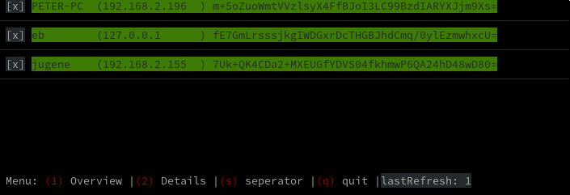

tl;dr
======

pepper is a remote code execution system to control multiple computers
at once, from a master computer. The system consists of 3 core components:

1. The master (pepperd):
  Slaves connect to the master, the master sends commands to the slaves.
2. The slaves (pepperslave):
  Slaves run on computers that should be controlled. Slaves connect to the master and waits for commands.
3. The control tool (pepper):
  The control tool is used by administrators to send commands through the master to the 
  slaves.


walkthrough
===========

1. install and start the master (`pepperd`) on a machine that is reachable
    from the slaves.
    The master generates a public/private keypair and writes it into the
    `config/masterconfig.ini`. the publicKey is interesting for us because,
    every slave needs to know the master's public key.
2. install and start the slave (`pepperslave`) on a machine(s).
    the slave then generates a public/private keypair and writes it into the
    `configSlave/slaveconfig.ini`
    - then we must add the following lines to the slaveconfig

      ```
      [master]
      server="<the ip or the hostname of our master>"
      port=8989
      publicKey="<our masters public key>"
      ```
3. the slave now tries to connect to the master (`pepperd`). 
    The master learns about the slave and stores its name and publickey.
    The client (`pepperslave`) is not allowed to talk to the master yet,
    so we must manually accept the client.
    
    !! <b>*make sure* that the public key, thats shown here match the key the client has created </b>!!!

    this is the only way to make the whole process secure!
    
    
    ```
    ./pepper keys list

    accepted:
      
    unaccepted:
      "slaveName" <the slaves public key>

    ./pepper keys accept slaveName
      ACCEPT: slaveName


    ./pepper call "*" "defaults.ping"
    #################
    slaveName
    pong

    ./pepper call "slaveNa*" "os.shell" "uname; uname -r" 
    #################
    slaveName
    Linux
    5.2.6-arch1-1-ARCH

    ```

call commandos 
===============


text substitiution
==================

text in commandos can be substituted:

- text in `${<text>}` is substituted by the pepperslave.
  When the substitution is not found, check the slaves process environment.
  <b>warning, the local shell might break the substitution, so use \"'\'</b>
eg:
  ```
  ./pepper call "*" "dynamic.load" '${modules}/dummy/sdummy'
  ./pepper call "*" "os.shell" 'echo ${slavedir}'
  ./pepper call "*" "os.shell" 'echo ${PATH}'
  ```

for a complete list of all valid substitions consult:

```
# for slave substitutions
./pepper call "*" "defaults.substitutions"

# for master substitutions
./pepper substitution list
```


distribute files
===============
<b>!! NOT IMPLEMENTED YET !!</b>
the pepperd is also a http server.
dynamic loaded modules, new pepperSlave versions are distributed that way.
but every file you want, can be distributed to the slaves.
For this, copy files into the `www` folder.
pepperd implements three kinds of "security levels":

1. www/1_plaintext
    - files are transmitted in plaintext, and no cryptography is added.
    - Only transfer files this way that are already encrypted or tampering protected.
    - This can be used for big files
2. www/2_signed
    - files are transmitted in plaintext, but are signed by the master.
    - So the content is visible to possible man in the middle attackers, but they can 
      not change it.
    - This can be used for medium/big files.
3. www/3_signed_crypted
    - files are transmitted encrypted and signed the same way the websocket commandchannel 
      is encrypted and signed.
    - This can be used for small/medium sized files.

just place the files into the folder and you're good to go!

modules
=======

nearly every feature a slave has, is implemented by modules.
There are two ways to add features to the slave.
Either by compile modules into the slave. 
This requires pepperslave recompilation.
Or load a module (*.dll or *.so or *.dylib) on runtime.

The master can also be extendet by modules, for instructions please see 
the modules master sections below.

slave: compile modules into the slave
------------------------------

every module that is listed in:

```
modules/slaveModules.nim
```

is compiled into the ```pepperSlave``` binary.

Modules for slaves are prefixed with an 's':

```sdummy.nim``` or ```sping.nim```

Please have a look how the current modules are implemented to 
get an idea how to write one yourself.
<b>the api is not finalized yet and is likely to change during further development</b>


slave: load modules on runtime
--------------------------------------

compile a module with:

```nim c --app:lib yourModule.nim```

copy the resulting dynamic library to the slave machine (this will be automated later OR there will be a way to upload modules to the slaves through nimPepper)

then call something like this:

```
./pepper "*" "dynamic.load" '${modules}/yourModuleFolder/yourmodule'
```
the moduleloader is platform agnostic so it automatically appends: 
- *.dll for windows
- lib*.so for linux
- etc

<b>WARN loader and modules must be build the same! both must be release OR both must be debug builds</b>


master: compile modules into the master
---------------------------------------

every module that is listed in:

```
modules/masterModules.nim
```

is compiled into the ```pepperd``` binary.

Modules for the master are prefixed with an 'm':

```mdummy.nim``` or ```mwww.nim```

Please have a look how the current modules are implemented to 
get an idea how to write one yourself.
<b>the api is not finalized yet and is likely to change during further development</b>


list available commands/modules (on the slaves)
--------------------------------

this lists all available commands/modules, there should be no difference between statically compiled modules or dynamically loaded modules. Both should work the same, and these commands lists both of them:

``` 
./pepper call "*" "dynamic.modules"
./pepper call "*" "dynamic.list"
```


interactive overview
====================

the plan for nimPepper also is to be a simple monitoring tool.
The beginnings of this plan can be seen with:

```
./pepper slaves online interactive
```



test ws
======

```
wscat -c ws://127.0.0.1:8989 -s pepper
{"raw": "raw", "senderPublicKey": "key", "signature": "signature"}
{"raw": "raw", "senderPublicKey": "PPPPPPPPPPPPPPPPPPPPPPPPPPPPPPPP", "signature": "SSSSSSSSSSSSSSSSSSSSSSSSSSSSSSSSSSSSSSSSSSSSSSSSSSSSSSSSSSSSSSSS"}

```